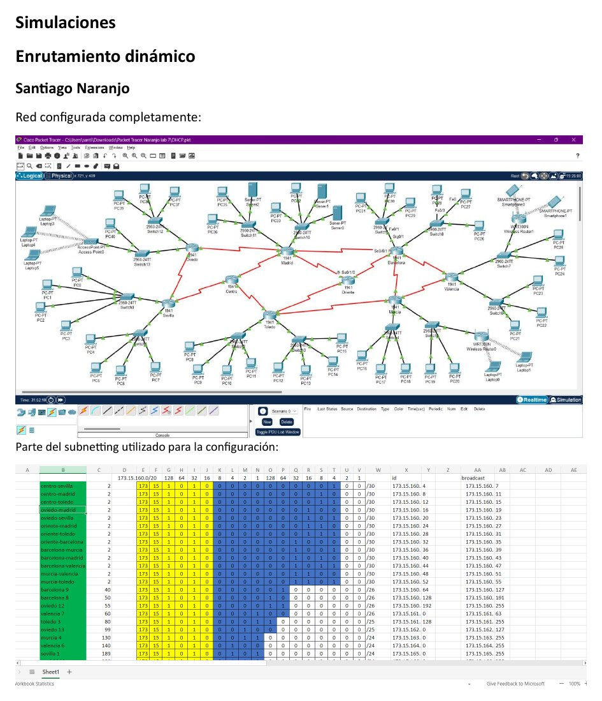
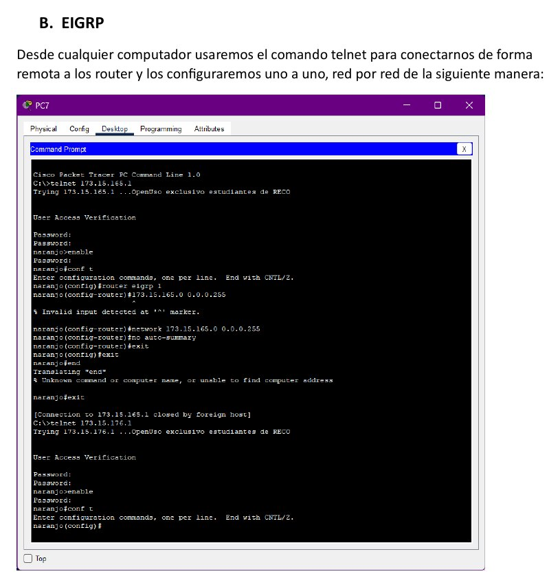
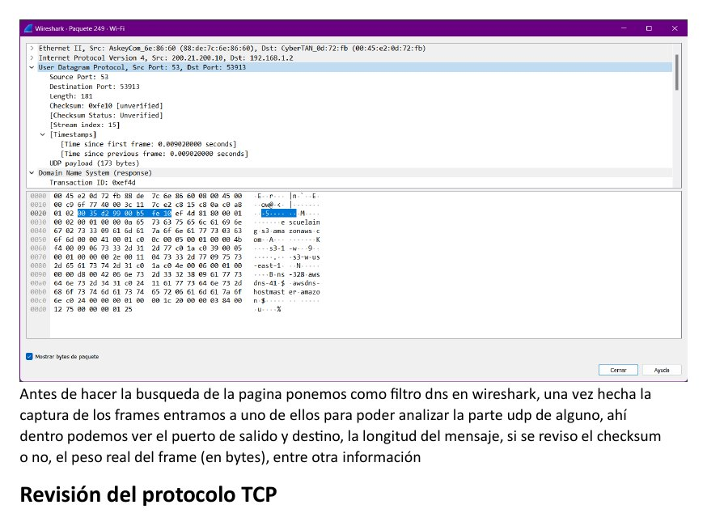

# Laboratorio 7 - Enrutamiento dinámico y análisis de transporte

**Autores:** Juan Esteban Ortiz Pastrana y Santiago Alberto Naranjo Abril  
**Institución:** Escuela Colombiana de Ingeniería Julio Garavito  
**Grupo:** 2  
**Fecha:** 18 de noviembre de 2023

## Objetivo

Comparar mecanismos de enrutamiento, configurar RIP, EIGRP y OSPF, y analizar tráfico UDP y TCP con Wireshark.

## Marco teórico

| Mecanismo | Característica |
| --- | --- |
| Enrutamiento estático | Las rutas se definen manualmente |
| Enrutamiento dinámico | Los routers actualizan sus tablas según la topología |
| Vector distancia | Intercambia información con vecinos y calcula distancia |
| Estado de enlace | Mantiene información de enlaces y calcula la mejor ruta |

El informe estudia RIP, IGRP, EIGRP y OSPF:

- **RIP:** utiliza conteo de saltos.
- **IGRP:** combina ancho de banda, retardo, confiabilidad y carga.
- **EIGRP:** mejora IGRP y usa valores `K` o pesos.
- **OSPF:** selecciona rutas mediante costo, relacionado con el ancho de banda.

## Topología y subnetting

Se partió de la distribución del laboratorio anterior, se asignaron direcciones a las LAN y se conectaron routers mediante enlaces seriales. Antes de habilitar enrutamiento, cada host solo podía alcanzar su red y gateway.



## Experimentos

### RIP con VLSM

Se configuraron redes en los routers y se verificó la comunicación con vecinos. La tabla de enrutamiento permitió diferenciar redes conectadas directamente y rutas aprendidas.

### EIGRP

Se accedió a los routers mediante Telnet y se reemplazó la configuración anterior:

```text
no router rip
router eigrp 1
network <direccion>
```



### OSPF

Se liberó la configuración de EIGRP, se inició un proceso OSPF y se declararon vecinos y redes. La ruta preferida corresponde al menor costo; un enlace con mayor ancho de banda produce un costo menor.

## Análisis de UDP y TCP

Wireshark se utilizó para revisar:

- Puertos de origen y destino.
- Longitud del mensaje.
- Checksum.
- Tamaño del frame.
- Números de secuencia y reconocimiento en TCP.



## Conclusiones

La experimentación muestra que el protocolo elegido puede afectar la velocidad y la estabilidad de la red. No existe un único mecanismo adecuado para todos los escenarios: la topología, las métricas y la complejidad de administración determinan cuál resulta más conveniente.

## Informe y archivos

- [Informe completo en PDF](laboratorio-07-enrutamiento-dinamico.pdf)
- `Laboratorio7.docx`
- Topologías DHCP y EIGRP de Santiago Naranjo
- Hoja de subnetting
